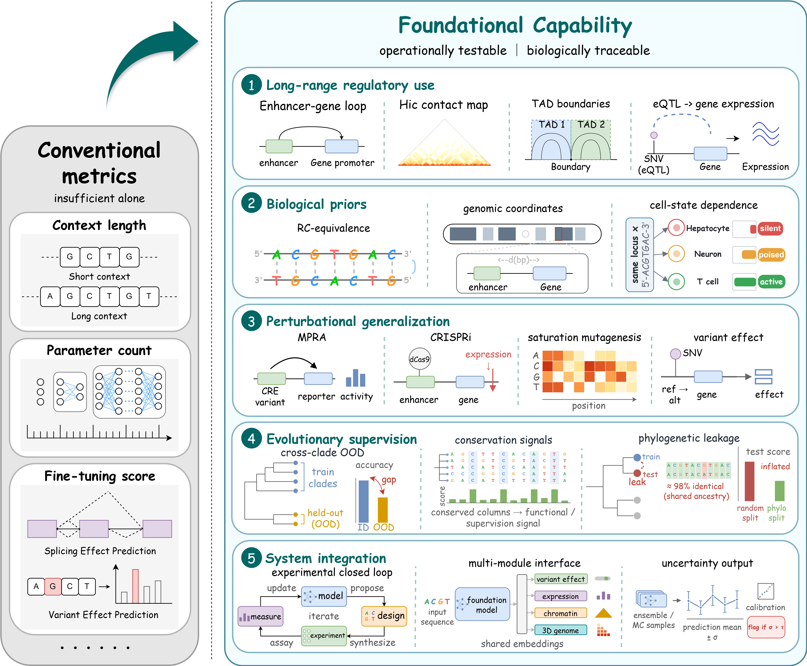

<div align="center">

<p align="center">
  
</p>

<h1 align="center">Awesome DNA Foundation Models</h1>

### What Makes a DNA Foundation Model Foundational?

[](#citation)
[](#)
[](../latex/main.pdf)
[](#)
[](#contributing)

**A curated survey repository for DNA foundation models, genomic pretraining corpora, benchmarks, and evidence criteria for sequence-to-function generalization.**

</div>

This repository accompanies our survey on **DNA Foundation Models (DNAFMs)**, an emerging class of pretrained genomic sequence models for learning sequence representations, regulatory signals, and sequence-to-function relationships. We will keep this repo continuously updated as the field evolves.

- 🧬 **A systematic DNAFM survey**, covering model architectures, pretraining objectives, tokenization strategies, training corpora, benchmark protocols, and downstream biological tasks.
- 🧭 **A foundation-capability framework**, asking what makes a DNA model genuinely foundational beyond parameter scale, context length, and local fine-tuning scores.
- 🔬 **Evidence criteria included**: long-range regulatory use, DNA-specific biological priors, perturbational generalization, evolutionary supervision, and modular biological AI systems.
- 📚 **Curated resources included**: representative DNA foundation models, pretraining corpus categories, and evaluation benchmarks.
- 🤝 **Community-driven**: found a missing model, benchmark, dataset, paper link, or correction? Feel free to open an issue or submit a pull request.

<p align="center">
  
</p>

## News

- **[2026-07-09]** Initial README release with the review framework, model landscape, corpus taxonomy, and benchmark map.

## Contents

- [Tag Legend](#tag-legend)
- [DNA Foundation Models](#dna-foundation-models)
- [Pretraining Corpora](#pretraining-corpora)
- [Benchmarks and Evaluation](#benchmarks-and-evaluation)
- [Contributing](#contributing)
- [Citation](#citation)
- [Acknowledgements](#acknowledgements)

## Tag Legend

### Model design tags

-  causal language modeling
-  masked language modeling
-  hybrid autoregressive and masked objectives
-  discrete diffusion or diffusion-style sequence modeling
-  species-aware or representation contrast
-  additional supervised or biological objectives

### Biological scope tags

-  human or eukaryotic reference-centered data
-  genomes across multiple species
-  bacterial, archaeal, or phage genomes
-  metagenomic or environmental sequences
-  viruses, plasmids, phages, or mobile elements
-  plant-focused genomes or plant regulatory sequence data
-  bacteria, archaea, eukaryotes, viruses, organelles, and metagenomes

### Evidence tags

-  enhancer-gene, eQTL, chromatin contact, TAD, or distal variant evidence
-  reverse complementarity, coordinates, coding frame, conservation, cell state, or 3D genome priors
-  variant effect, mutagenesis, CRISPR, MPRA, eQTL, or design validation
-  chromosome, species, gene, cell-type, variant-class, or clade-level splits

## DNA Foundation Models

The table below follows the model landscape summarized in the manuscript. Official paper, code, and model links are shown only when verified; unavailable resources are omitted.

| Model | Model Type | Pretraining Corpus | Released | Links |
| --- | --- | --- | --- | --- |
| Evo 1 |  |  | 2024.02 | 📄 [Paper](https://www.science.org/doi/10.1126/science.ado9336)<br>💻 [Code](https://github.com/evo-design/evo)<br>📘 [Tutorial](https://colab.research.google.com/github/evo-design/evo/blob/main/scripts/hello_evo.ipynb)<br>🤗 [Model](https://huggingface.co/togethercomputer/evo-1-131k-base) |
| Evo 1.5 |  |  | 2024.12 | 📄 [Paper](https://www.nature.com/articles/s41586-025-09749-7)<br>💻 [Code](https://github.com/evo-design/evo)<br>📘 [Tutorial](https://colab.research.google.com/github/evo-design/evo/blob/main/scripts/hello_evo.ipynb)<br>🤗 [Model](https://huggingface.co/evo-design/evo-1.5-8k-base) |
| Evo 2 |  |  | 2025.02 | 📄 [Paper](https://www.nature.com/articles/s41586-026-10176-5)<br>💻 [Code](https://github.com/ArcInstitute/evo2)<br>📘 [Tutorial](https://github.com/ArcInstitute/evo2/tree/main/notebooks)<br>🤗 [Model](https://huggingface.co/arcinstitute/evo2_7b) |
| Nucleotide Transformer v1 |  |  | 2023.01 | 📄 [Paper](https://www.nature.com/articles/s41592-024-02523-z)<br>💻 [Code](https://github.com/instadeepai/nucleotide-transformer)<br>📘 [Tutorial](https://github.com/instadeepai/nucleotide-transformer/blob/main/docs/nucleotide_transformer.md)<br>🤗 [Model](https://huggingface.co/collections/InstaDeepAI/nucleotide-transformer) |
| Nucleotide Transformer v2 |  |  | 2024.01 | 📄 [Paper](https://www.nature.com/articles/s41592-024-02523-z)<br>💻 [Code](https://github.com/instadeepai/nucleotide-transformer)<br>📘 [Tutorial](https://github.com/instadeepai/nucleotide-transformer/blob/main/docs/nucleotide_transformer.md)<br>🤗 [Model](https://huggingface.co/InstaDeepAI/nucleotide-transformer-v2-500m-multi-species) |
| Nucleotide Transformer v3 |  |  | 2025.12 | 📄 [Paper](https://www.biorxiv.org/content/10.64898/2025.12.22.695963v1)<br>💻 [Code](https://github.com/instadeepai/nucleotide-transformer)<br>📘 [Tutorial](https://github.com/instadeepai/nucleotide-transformer/blob/main/docs/nucleotide_transformer_v3.md)<br>🤗 [Model](https://huggingface.co/InstaDeepAI/NTv3_650M_pre) |
| Caduceus |  |  | 2024.03 | 📄 [Paper](https://proceedings.mlr.press/v235/schiff24a.html)<br>💻 [Code](https://github.com/kuleshov-group/caduceus)<br>🤗 [Model](https://huggingface.co/kuleshov-group/caduceus-ps_seqlen-131k_d_model-256_n_layer-16) |
| DNABERT |  |  | 2020.09 | 📄 [Paper](https://doi.org/10.1093/bioinformatics/btab083)<br>💻 [Code](https://github.com/jerryji1993/DNABERT)<br>📘 [Tutorial](https://github.com/jerryji1993/DNABERT/tree/master/examples)<br>🤗 [Model](https://huggingface.co/zhihan1996/DNA_bert_6) |
| DNABERT-2 |  |  | 2023.06 | 📄 [Paper](https://arxiv.org/abs/2306.15006)<br>💻 [Code](https://github.com/MAGICS-LAB/DNABERT_2)<br>📘 [Tutorial](https://github.com/MAGICS-LAB/DNABERT_2#4-quick-start)<br>🤗 [Model](https://huggingface.co/zhihan1996/DNABERT-2-117M) |
| DNABERT-S |  |  | 2024.02 | 📄 [Paper](https://arxiv.org/abs/2402.08777)<br>💻 [Code](https://github.com/MAGICS-LAB/DNABERT_S)<br>📘 [Tutorial](https://github.com/MAGICS-LAB/DNABERT_S#4-quick-start)<br>🤗 [Model](https://huggingface.co/zhihan1996/DNABERT-S) |
| HyenaDNA |  |  | 2023.06 | 📄 [Paper](https://arxiv.org/abs/2306.15794)<br>💻 [Code](https://github.com/HazyResearch/hyena-dna)<br>📘 [Tutorial](https://colab.research.google.com/drive/1wyVEQd4R3HYLTUOXEEQmp_I8aNC_aLhL?usp=sharing)<br>🤗 [Model](https://huggingface.co/LongSafari/hyenadna-large-1m-seqlen-hf) |
| Genos |  |  | 2025.10 | 📄 [Paper](https://doi.org/10.1093/gigascience/giaf132)<br>💻 [Code](https://github.com/BGI-HangzhouAI/Genos)<br>📘 [Tutorial](https://github.com/BGI-HangzhouAI/Genos/tree/main/Notebooks)<br>🤗 [Model](https://huggingface.co/collections/BGI-HangzhouAI/genos) |
| OmniReg-GPT |  |  | 2025.07 | 📄 [Paper](https://doi.org/10.1038/s41467-025-65066-7)<br>💻 [Code](https://github.com/wawpaopao/OmniReg-GPT)<br>📘 [Tutorial](https://github.com/wawpaopao/OmniReg-GPT/tree/main/example)<br>🤗 [Model](https://zenodo.org/records/14893616) |
| GENA-LM |  |  | 2023.06 | 📄 [Paper](https://doi.org/10.1093/nar/gkae1310)<br>💻 [Code](https://github.com/AIRI-Institute/GENA_LM)<br>📘 [Tutorial](https://github.com/AIRI-Institute/GENA_LM/tree/main/examples)<br>🤗 [Model](https://huggingface.co/AIRI-Institute/gena-lm-bigbird-base-t2t) |
| GROVER |  |  | 2023.07 | 📄 [Paper](https://doi.org/10.1038/s42256-024-00872-0) |
| GenomeOcean |  |  | 2025.01 | 📄 [Paper](https://www.biorxiv.org/content/10.1101/2025.01.30.635558v2)<br>💻 [Code](https://github.com/jgi-genomeocean/genomeocean)<br>📘 [Tutorial](https://github.com/jgi-genomeocean/genomeocean/tree/main/examples)<br>🤗 [Model](https://huggingface.co/pGenomeOcean/GenomeOcean-4B) |
| GENERator v1 |  |  | 2025.02 | 📄 [Paper](https://arxiv.org/abs/2502.07272)<br>💻 [Code](https://github.com/GenerTeam/GENERator)<br>📘 [Tutorial](https://github.com/GenerTeam/GENERator#-quick-start)<br>🤗 [Model](https://huggingface.co/GenerTeam/GENERator-eukaryote-3b-base) |
| GENERator v2 |  |  | 2026.01 | 📄 [Paper](https://www.biorxiv.org/content/10.64898/2026.01.27.702015v1)<br>💻 [Code](https://github.com/GenerTeam/GENERator)<br>📘 [Tutorial](https://github.com/GenerTeam/GENERator#-quick-start)<br>🤗 [Model](https://huggingface.co/GenerTeam/GENERator-v2-prokaryote-3b-base) |
| AIDO.DNA |  |  | 2024.12 | 📄 [Paper](https://doi.org/10.1101/2024.12.01.625444)<br>💻 [Code](https://github.com/genbio-ai/ModelGenerator)<br>📘 [Tutorial](https://github.com/genbio-ai/AIDO-Foundations-Tutorials)<br>🤗 [Model](https://huggingface.co/genbio-ai/AIDO.DNA-7B) |
| LucaOne |  |  | 2024.05 | 📄 [Paper](https://www.nature.com/articles/s42256-025-01044-4)<br>💻 [Code](https://github.com/LucaOne/LucaOne)<br>📘 [Tutorial](https://github.com/LucaOne/LucaOne#6-embedding-inference)<br>🤗 [Model](https://huggingface.co/collections/LucaGroup/lucaone) |
| LucaVirus |  |  | 2025.06 | 📄 [Paper](https://www.biorxiv.org/content/10.1101/2025.06.14.659722v1)<br>💻 [Code](https://github.com/LucaOne/LucaVirus)<br>🤗 [Model](https://huggingface.co/collections/LucaGroup/lucavirus) |
| GPN |  |  | 2022.08 | 📄 [Paper](https://doi.org/10.1073/pnas.2311219120)<br>💻 [Code](https://github.com/songlab-cal/gpn)<br>📘 [Tutorial](https://github.com/songlab-cal/gpn/blob/main/examples/ss/basic_example.ipynb)<br>🤗 [Model](https://huggingface.co/songlab/gpn-brassicales) |
| GPN-MSA |  |  | 2023.10 | 📄 [Paper](https://www.nature.com/articles/s41587-024-02511-w)<br>💻 [Code](https://github.com/songlab-cal/gpn)<br>📘 [Tutorial](https://github.com/songlab-cal/gpn/blob/main/examples/msa/basic_example.ipynb)<br>🤗 [Model](https://huggingface.co/songlab/gpn-msa-sapiens) |
| megaDNA |  |  | 2023.12 | 📄 [Paper](https://www.biorxiv.org/content/10.1101/2023.12.18.572218v3)<br>💻 [Code](https://github.com/lingxusb/megaDNA)<br>📘 [Tutorial](https://github.com/lingxusb/megaDNA/blob/main/notebook/megaDNA_generate.ipynb)<br>🤗 [Model](https://huggingface.co/lingxusb/megaDNA_updated) |
| AgroNT |  |  | 2023.10 | 📄 [Paper](https://www.nature.com/articles/s42003-024-06465-2)<br>💻 [Code](https://github.com/instadeepai/nucleotide-transformer)<br>📘 [Tutorial](https://github.com/instadeepai/nucleotide-transformer/blob/main/docs/agro_nucleotide_transformer.md)<br>🤗 [Model](https://huggingface.co/collections/InstaDeepAI/agro-nucleotide-transformer-65b25c077cd0069ad6f6d344) |
| ProkBERT |  |  | 2024.01 | 📄 [Paper](https://www.frontiersin.org/articles/10.3389/fmicb.2023.1331233)<br>💻 [Code](https://github.com/nbrg-ppcu/prokbert)<br>📘 [Tutorial](https://github.com/nbrg-ppcu/prokbert/blob/main/examples/Inference.ipynb)<br>🤗 [Model](https://huggingface.co/neuralbioinfo/prokbert-mini) |
| SpeciesLM |  |  | 2023.01 | 📄 [Paper](https://doi.org/10.1101/2023.01.26.525670)<br>💻 [Code](https://github.com/gagneurlab/SpeciesLM)<br>📘 [Tutorial](https://github.com/gagneurlab/SpeciesLM/blob/main/ModelUsage.ipynb)<br>🤗 [Model](https://huggingface.co/gagneurlab/SpeciesLM) |
| Mistral-DNA |  |  | 2024 | 💻 [Code](https://github.com/raphaelmourad/Mistral-DNA)<br>📘 [Tutorial](https://github.com/raphaelmourad/Mistral-DNA#prediction-mutation-effect-with-zero-shot-learning-using-the-pretrained-model)<br>🤗 [Model](https://huggingface.co/RaphaelMourad/Mistral-DNA-v1-422M-hg38) |
| PlantCAD |  |  | 2024.06 | 📄 [Paper](https://doi.org/10.1073/pnas.2421738122)<br>💻 [Code](https://github.com/plantcad/plantcad)<br>📘 [Tutorial](https://github.com/plantcad/plantcad/blob/main/notebooks/examples.ipynb)<br>🤗 [Model](https://huggingface.co/collections/kuleshov-group/plantcaduceus-512bp-len-665a229ee098db706a55e44a) |
| PlantCAD2 |  |  | 2025.08 | 📄 [Paper](https://www.biorxiv.org/content/10.1101/2025.08.27.672609v3)<br>💻 [Code](https://github.com/plantcad/plantcad)<br>📘 [Tutorial](https://github.com/plantcad/plantcad/blob/main/docs/PlantCAD2-overview.md)<br>🤗 [Model](https://huggingface.co/collections/kuleshov-group/plantcad2-67e437e241a382671371a572) |
| HybriDNA |  |  | 2025.02 | 📄 [Paper](https://arxiv.org/abs/2502.10807)<br>🤗 [Model](https://huggingface.co/Mishamq/HybriDNA-7B) |
| Gene42 |  |  | 2025.03 | 📄 [Paper](https://arxiv.org/abs/2503.16565)<br>🤗 [Model](https://huggingface.co/inceptionai) |
| MxDNA |  |  | 2024.12 | 📄 [Paper](https://doi.org/10.52202/079017-2112)<br>💻 [Code](https://github.com/qiaoqiaoLF/MxDNA) |
| METAGENE-1 |  |  | 2025.01 | 📄 [Paper](https://doi.org/10.32388/fmepo7)<br>💻 [Code](https://github.com/metagene-ai/metagene-pretrain)<br>📘 [Tutorial](https://github.com/metagene-ai/metagene-pretrain/tree/main/train/tutorials)<br>🤗 [Model](https://huggingface.co/metagene-ai/METAGENE-1) |
| Life-Code |  |  | 2025.02 |  |
| UKBioBERT |  |  | 2025.02 |  |
| JanusDNA |  |  | 2025.05 | 📄 [Paper](https://arxiv.org/abs/2505.17257)<br>💻 [Code](https://github.com/Qihao-Duan/JanusDNA)<br>🤗 [Model](https://dataverse.harvard.edu/dataset.xhtml?persistentId=doi%3A10.7910%2FDVN%2FHDT0RN&version=DRAFT) |
| Omni-DNA |  |  | 2025.02 | 📄 [Paper](https://arxiv.org/abs/2502.03499)<br>💻 [Code](https://github.com/Zehui127/Omni-DNA)<br>📘 [Tutorial](https://github.com/Zehui127/Omni-DNA#examples)<br>🤗 [Model](https://huggingface.co/collections/zehui127/omni-dna-67a2230c352d4fd8f4d1a4bd) |
| LOGO |  |  | 2021.08 |  |
| DNAGPT |  |  | 2023.07 | 📄 [Paper](https://www.biorxiv.org/content/10.1101/2023.07.11.548628v2)<br>💻 [Code](https://github.com/TencentAILabHealthcare/DNAGPT)<br>📘 [Tutorial](https://github.com/TencentAILabHealthcare/DNAGPT#example)<br>🤗 [Model](https://github.com/TencentAILabHealthcare/DNAGPT#download-pre-trained-weights) |
| ENBED |  |  | 2023.11 | 📄 [Paper](https://doi.org/10.1093/bioadv/vbae117) |
| OmniNA |  |  | 2024.01 | 📄 [Paper](https://doi.org/10.1101/2024.01.14.575543)<br>🤗 [Model](https://huggingface.co/XLS/OmniNA-1.7B) |
| regLM |  |  | 2023.10 | 📄 [Paper](https://www.biorxiv.org/content/10.1101/2024.02.14.580373v1)<br>💻 [Code](https://github.com/Genentech/regLM)<br>📘 [Tutorial](https://github.com/Genentech/regLM/blob/main/tutorials/tutorial.ipynb) |
| dnaHNet |  |  | 2026.02 |  |
| D3LM |  |  | 2026.03 | 📄 [Paper](https://arxiv.org/abs/2603.01780)<br>🤗 [Model](https://huggingface.co/collections/Hengchang-Liu/d3lm) |


## Pretraining Corpora

Pretraining corpora are not just data sources; they define which biological regularities a model can access and which biases it may inherit.

| Representative sources | Data composition | Links |
| --- | --- | --- |
| GRCh38/hg38 | Human reference assembly used as the dominant coordinate system for reference-sequence pretraining and many human regulatory benchmarks. | 🌐 [NCBI Datasets](https://www.ncbi.nlm.nih.gov/datasets/genome/GCF_000001405.40/)<br>🌐 [UCSC hg38](https://genome.ucsc.edu/cgi-bin/hgGateway?db=hg38) |
| T2T-CHM13 | Gapless telomere-to-telomere human assembly resolving centromeres, acrocentric short arms, segmental duplications, and other previously missing regions. | 🌐 [NCBI Datasets](https://www.ncbi.nlm.nih.gov/datasets/genome/GCF_009914755.1/) |
| hg19 | Legacy GRCh37/UCSC human reference widely used by older epigenomic annotations, regulatory datasets, and benchmark splits. | 🌐 [UCSC hg19](https://genome.ucsc.edu/cgi-bin/hgGateway?db=hg19) |
| mm10/mm39 | Mouse reference assemblies used for mammalian regulatory sequence modeling, mouse functional genomics tracks, and cross-species transfer. | 🌐 [UCSC mm10](https://genome.ucsc.edu/cgi-bin/hgGateway?db=mm10)<br>🌐 [UCSC mm39](https://genome.ucsc.edu/cgi-bin/hgGateway?db=mm39) |
| TAIR10 | Arabidopsis thaliana reference genome and gene annotation baseline for plant sequence-function datasets. | 🌐 [TAIR10 release](https://www.arabidopsis.org/download/index-auto.jsp?dir=%2Fdownload_files%2FGenes%2FTAIR10_genome_release) |
| 1000 Genomes Project | Phased human variants and haplotypes across global populations, enabling allele-specific or variant-aware sequence construction. | 🌐 [Project portal](https://www.internationalgenome.org/) |
| 3,202 high-coverage human genomes | High-depth 1000 Genomes GRCh38 call set with SNVs, indels, and structural variants for population-scale sequence variation. | 📦 [30x GRCh38 call set](https://www.internationalgenome.org/data-portal/data-collection/30x-grch38) |
| Human Pangenome Reference Consortium | Haplotype-resolved human pangenome assemblies and graph references capturing alternatives absent from a single linear reference. | 🌐 [Project portal](https://humanpangenome.org/) |
| Ensembl Genomes | Comparative genome and annotation resource for non-vertebrate eukaryotes, bacteria, plants, fungi, protists, and metazoa. | 🌐 [Portal](https://ensemblgenomes.org/) |
| NCBI RefSeq | Curated reference sequences and genome assemblies with standardised annotation across taxa. | 🌐 [RefSeq](https://www.ncbi.nlm.nih.gov/refseq/) |
| NCBI GenBank | Primary archival nucleotide sequence database containing submitted genomic sequences and assemblies before RefSeq curation. | 🌐 [GenBank](https://www.ncbi.nlm.nih.gov/genbank/) |
| Phytozome | JGI plant comparative genomics portal with plant genome assemblies, gene models, families, and functional annotations. | 🌐 [Portal](https://phytozome-next.jgi.doe.gov/) |
| OpenGenome | Evo pretraining corpus of prokaryotic and phage whole-genome sequences at single-nucleotide resolution. | 🤗 [Dataset](https://huggingface.co/datasets/LongSafari/open-genome) |
| NCBI RefSeq Bacteria/Archaea | Curated bacterial and archaeal assemblies and annotations used for microbial genome representation. | 🌐 [RefSeq prokaryotes](https://www.ncbi.nlm.nih.gov/refseq/about/prokaryotes/) |
| GenBank Prokaryotic Genomes | Broad submitted prokaryotic genome assemblies, including draft genomes and isolates with variable curation status. | 🌐 [NCBI Genome browser](https://www.ncbi.nlm.nih.gov/genome/browse#!/prokaryotes/) |
| IMG/VR | Viral genome catalogue from isolate and metagenomic data, useful for phage-inclusive microbial pretraining. | 🌐 [IMG/VR](https://img.jgi.doe.gov/vr/) |
| GenomeOcean corpus | Large-scale metagenomic assemblies used by GenomeOcean, emphasising microbial contigs from environmental and host-associated samples. | 💻 [Repository](https://github.com/jgi-genomeocean/genomeocean)<br>📄 [Paper](https://www.biorxiv.org/content/10.1101/2025.01.30.635558v2) |
| IMG/M | Integrated microbial genomes and microbiomes resource with metagenome projects, MAGs, isolate genomes, and functional annotations. | 🌐 [IMG/M](https://img.jgi.doe.gov/m/) |
| MGnify | EMBL-EBI metagenomics resource with assembled contigs, annotations, taxonomic profiles, and biome metadata. | 🌐 [MGnify](https://www.ebi.ac.uk/metagenomics/) |
| JGI Metagenome | JGI project portal for environmental sequencing projects and metagenomic datasets feeding IMG/M-style resources. | 🌐 [JGI portal](https://genome.jgi.doe.gov/portal/) |
| GOLD | Genome Online Database metadata catalogue for genome and metagenome projects, sampling environments, sequencing status, and study metadata. | 🌐 [GOLD](https://gold.jgi.doe.gov/) |
| Tara Oceans | Marine microbial, viral, and plankton omics samples from global ocean expeditions, available through ENA project records. | 📦 [ENA PRJEB402](https://www.ebi.ac.uk/ena/browser/view/PRJEB402) |
| NCBI Virus | Curated virus sequence portal with genome records, isolate metadata, host information, and sequence downloads. | 🌐 [NCBI Virus](https://www.ncbi.nlm.nih.gov/labs/virus/vssi/#/) |
| GenBank Viral | Submitted viral nucleotide records in GenBank, covering complete genomes, segments, isolates, and partial viral sequences. | 🌐 [GenBank](https://www.ncbi.nlm.nih.gov/genbank/) |
| IMG/VR | Viral isolate and metagenomic sequence catalogue supporting phage and environmental viral genome discovery. | 🌐 [IMG/VR](https://img.jgi.doe.gov/vr/) |
| PhagesDB | Community phage database with bacteriophage genomes, host annotations, clusters, and related metadata. | 🌐 [PhagesDB](https://phagesdb.org/) |
| PLSDB | Curated plasmid database containing plasmid sequences, host information, and metadata for mobile genetic element studies. | 🌐 [PLSDB](https://ccb-microbe.cs.uni-saarland.de/plsdb/) |
| OpenGenome2 | Cross-domain Evo 2 pretraining corpus spanning bacteria, archaea, eukaryotes, viruses, organelles, and metagenomic sequence. | 🤗 [Dataset](https://huggingface.co/datasets/arcinstitute/opengenome2) |

## Benchmarks and Evaluation

Benchmarks should be interpreted as biological probes. A strong local classification score does not by itself establish long-range regulatory modeling, perturbation response, or mechanistic sequence-to-function understanding.

| Benchmark | Year | Task type | Input length | Links |
| --- | --- | --- | --- | --- |
| Genomic Benchmarks | 2023.05 | Sequence classification | Hundreds bp to several kb | 📄 [Paper](https://doi.org/10.1186/s12863-023-01123-8)<br>💻 [Code](https://github.com/ML-Bioinfo-CEITEC/genomic_benchmarks) |
| GUE / GUE+ | 2023.06 / 2024.03 | Multi-task sequence classification | 70 bp to 10 kb | 📄 [Paper](https://arxiv.org/abs/2306.15006)<br>💻 [Code/Data](https://github.com/MAGICS-LAB/DNABERT_2#2-model-and-data) |
| Nucleotide Transformer Benchmark | 2023.01 / 2024.11 | Functional genomics prediction | 6 kb to 12 kb | 📄 [Paper](https://doi.org/10.1038/s41592-024-02523-z)<br>🤗 [Data](https://huggingface.co/datasets/InstaDeepAI/nucleotide_transformer_downstream_tasks)<br>🤗 [Revised data](https://huggingface.co/datasets/InstaDeepAI/nucleotide_transformer_downstream_tasks_revised) |
| BEND | 2023.11 / 2024.05 | Genome annotation prediction | Local windows to long genomic intervals | 📄 [Paper](https://arxiv.org/abs/2311.12570)<br>💻 [Code/Data](https://github.com/frederikkemarin/BEND) |
| GenBench | 2024.06 | Multi-domain genomic prediction | 30 bp to 196 kb | 📄 [Paper](https://arxiv.org/abs/2406.01627) |
| DART-Eval | 2024.12 | Regulatory DNA prediction | Regulatory elements and local contexts | 📄 [Paper](https://arxiv.org/abs/2412.05430)<br>💻 [Code](https://github.com/kundajelab/DART-Eval) |
| Long-Range Benchmark (LRB) | 2023.06-2025.01 | Long-context expression and variant prediction | Tens kb to hundreds kb | 📄 [HyenaDNA](https://arxiv.org/abs/2306.15794)<br>📄 [DNALongBench preprint](https://www.biorxiv.org/content/10.1101/2025.01.06.631595v1) |
| DNALONGBENCH | 2025.01 / 2025.11 | Long-range regulatory prediction | 10 kb to 1 Mb | 📄 [Paper](https://doi.org/10.1038/s41467-025-65077-4)<br>💻 [Code/Data](https://github.com/ma-compbio/DNALONGBENCH) |
| Benchmarking DNA FMs | 2024.08 / 2025.11 | Cross-task embedding benchmark | 64 bp to 500 kb | 📄 [Paper](https://doi.org/10.1038/s41467-025-65823-8)<br>📄 [Preprint](https://doi.org/10.1101/2024.08.16.608288) |
| DeepSEA / Enformer-style | 2015.08 / 2021.10 | Functional genomics prediction | 1 kb to 196 kb | 📄 [DeepSEA paper](https://www.nature.com/articles/nmeth.3547)<br>🌐 [DeepSEA server](https://deepsea.princeton.edu/)<br>📄 [Enformer paper](https://www.nature.com/articles/s41592-021-01252-x)<br>💻 [Enformer code](https://github.com/google-deepmind/deepmind-research/tree/master/enformer) |
| Variant-effect and clinical benchmarks | 2013.11-2025.01 | Variant-effect prediction | Local windows to hundreds kb | 🌐 [ClinVar](https://www.ncbi.nlm.nih.gov/clinvar/)<br>🌐 [CAGI](https://genomeinterpretation.org/)<br>📦 [MaveDB](https://www.mavedb.org/) |
| NABench | 2025.11 | Fitness prediction | Assay-dependent | 📄 [Paper](https://arxiv.org/abs/2511.02888)<br>💻 [Code/Data](https://github.com/mrzzmrzz/NABench) |

## Contributing

Contributions are welcome. Please open an issue or pull request if you find:

- a missing DNA, RNA, nucleotide, or regulatory-sequence foundation model;
- a missing benchmark, dataset, or evaluation protocol;
- a corrected paper, code, model, dataset, or project-page link;
- an incorrect tag, corpus category, context length, parameter count, or objective;
- a benchmark result that should be interpreted with stronger leakage, split, or biological-scope caveats.

When adding a paper, please include the source link and avoid unsupported claims about foundation capability. Prefer bounded descriptions such as `tested on long-range expression prediction` over broad claims such as `understands regulation`.

## Citation

The public citation will be updated when the paper is released. For now, cite the manuscript as:

```bibtex
@article{ye2026dnafoundationmodels,
  title   = {What Makes a DNA Foundation Model Foundational? Long-Range Regulation, Biological Priors, and Perturbational Generalization},
  author  = {Ye, Dong-Xin},
  year    = {2026},
  note    = {Manuscript in preparation}
}
```

## Acknowledgements

We thank the researchers and open-source communities whose work has advanced DNA foundation models, genomic language modeling, regulatory sequence modeling, and sequence-to-function prediction. This repository builds upon publicly available papers, codebases, pretrained models, datasets, benchmarks, and tutorials released by the broader computational biology, genomics, and machine learning communities.

We are especially grateful to the authors and maintainers of the DNA, RNA, nucleotide, regulatory-sequence, microbial, viral, plant, and cross-domain genome modeling resources curated in this repository. Their open scientific contributions make it possible to compare model architectures, pretraining corpora, evaluation protocols, and biological evidence across this rapidly evolving field.

We also thank the community members who report missing models, update links, suggest benchmark corrections, improve taxonomy labels, and contribute discussions on what should qualify as a genuinely foundational DNA model. Feedback, issues, and pull requests are highly appreciated and will help keep this resource accurate, transparent, and useful for future research.

If this repository is useful to your work, please consider citing the associated manuscript once available and starring the repository to support its continued maintenance.
